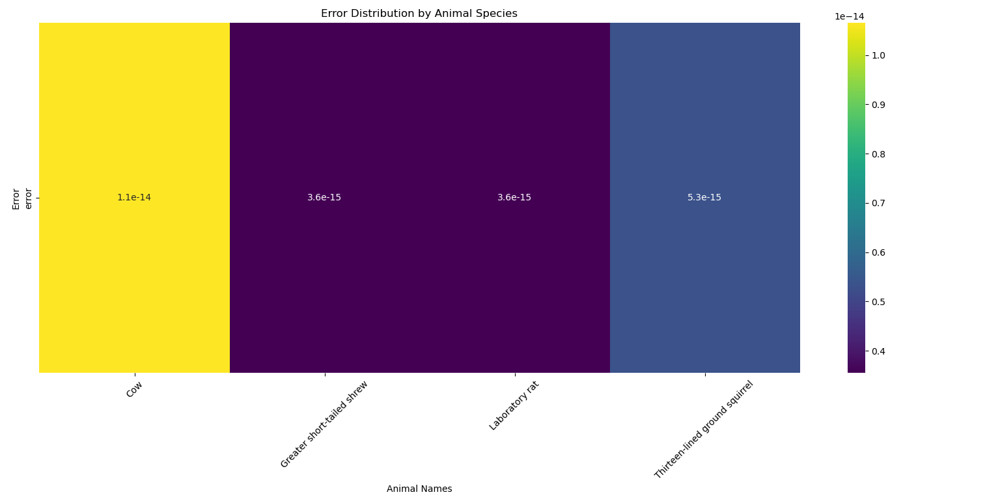

# SleepMap : Visualizing Animal Sleep Prediction Errors

## Table of Contents
1. [Project Overview](#project-overview)
2. [Project Structure](#project-structure)
3. [Dependencies](#dependencies)
4. [Data and Feature Selection](#data-and-feature-selection)
5. [Error Analysis and Visualization](#error-analysis-and-visualization)
   - [Heatmap of Prediction Errors by Species](#heatmap-of-prediction-errors-by-species)


## Project Overview
SleepMap is a data analysis project focused on understanding and visualizing prediction errors in animal sleep patterns. Using a linear regression model, we predict sleep duration for various animal species based on a set of physiological and environmental features, and then analyze the prediction accuracy for each species.

## Project Structure
- **Data Preprocessing**: We clean and preprocess the dataset by removing rows with missing values.
- **Feature Selection**: We select relevant features to predict the sleep duration of different species.
- **Model Training**: We split the dataset into training and testing sets and train a linear regression model.
- **Error Analysis**: We calculate the mean absolute error for each animal species to identify the accuracy of predictions by species.
- **Visualization**: Using a heatmap, we visualize the prediction errors to identify patterns in model performance across species.

## Dependencies
The project requires the following Python libraries:
- `pandas`
- `numpy`
- `matplotlib`
- `seaborn`
- `scikit-learn`

Install dependencies with:
```bash
pip install pandas numpy matplotlib seaborn scikit-learn
```
## Data and Feature Selection
The analysis uses the `msleep.csv` dataset, which contains various animal species along with their sleep-related characteristics. Key features used in the model include:

- **brainwt**: Brain weight
- **bodywt**: Body weight
- **sleep_cycle**: Duration of sleep cycles
- **sleep_rem**: REM sleep duration
- **sleep_total**: Total sleep duration (target variable)

## Error Analysis and Visualization
After training the model, we calculate the absolute error between the predicted and actual sleep durations. We then compute the average error for each species and visualize it with a heatmap.

### Heatmap of Prediction Errors by Species
The following heatmap provides an overview of the model's prediction accuracy for each animal species.



The heatmap reveals which species had higher prediction errors, highlighting areas where the model could be improved.

